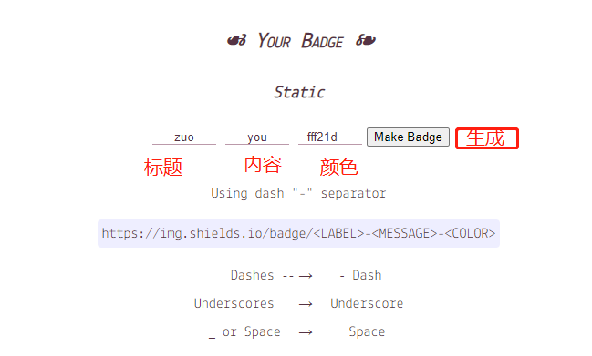

为了突出github的项目版本、技术栈版本列表、协议、平台、进度等等,所以为项目添加一些标记信息
<!-- more -->
<meta name="keyword" content="Github,shields,徽标,logo,旗帜,图标">

## 简介
#### [shields徽标制作网站](https://shields.io/)
网站地址https://shields.io/
#### 煮个栗子
<div>
	
	
	
	
</div>

## 制作方法
### 常用徽标

### 个性化徽标
`shields.io`提供了添加自定义徽标的功能，通过修改如下 URL 即可获取自定义徽标图片：
```markdown
https://img.shields.io/badge/{徽标标题}-{徽标内容}-{徽标颜色}.svg
```
{徽标标题}：徽标左半部分的文本（短线：–，下划线：__，空格： 或_）；
{徽标内容}：徽标右半部分的文本，同上；
{徽标颜色}：徽标右半部分背景颜色，可以是 red、green、blue 等颜色英文单词，也可以直接写十六进制的颜色值，如 ff69b4，示例如下：

```markdown
https://img.shields.io/badge/zuo-you-fff21d.svg
```

或者打开官网首页,填写相应的内容点击`make badge`生成


### 样式附加参数


### 带图标地址
[simpleicons](https://simpleicons.org/)支持图标地址


## 参考链接
[GitHub项目徽章的添加和设置](https://lpd-ios.github.io/2017/05/03/GitHub-Badge-Introduction/)